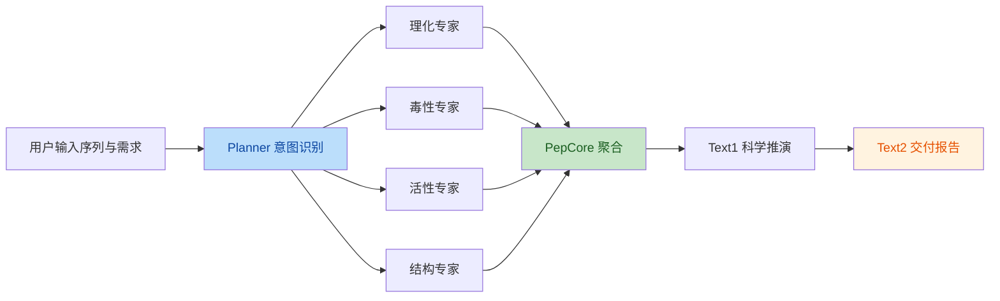

# Peptide Helper 架构说明

## 1. 项目定位

`Peptide Helper` 是一个基于 LangGraph 的多肽分析智能体流水线。
它将一次用户请求拆分为「规划 -> 并行执行 -> 聚合研判 -> 报告交付」四个阶段，
适合作为多 Agent 柔性生产线原型，也适合后续演进到真实模型和真实算法服务。

## 2. 核心业务流



## 3. 五层逻辑拆分

### 3.1 业务接入层

- 输入对象由 `create_initial_state()` 统一初始化。
- 当前接收字段为 `sequence` 和 `user_request`。
- 该层只负责接收请求和补齐状态默认值，不承担推理与业务判断。

### 3.2 调度指挥层

- `planner_node()` 通过关键词识别用户意图。
- 产物是 `required_tasks`，即本轮真正需要执行的专家节点列表。
- 如果用户未明确指定任务，则回退到默认任务 `phys_chem_node + toxicity_node`。

### 3.3 专家服务层

- `agents.py` 中的 4 个节点代表 4 类专业能力。
- 当前实现使用 Mock 数据，便于先验证编排链路。
- 后续接入真实模型时，只需替换单个节点实现，不影响其他节点。

### 3.4 融合决策层

- `pepcore_node()` 负责检查状态中已经完成的专家结果。
- 仅对有值的结果生成 Markdown 片段，不对缺失节点做强依赖。
- 这一层是业务上下文的统一入口，方便后续叠加加权评分、风控标签和一票否决规则。

### 3.5 表达交付层

- `text1_node()` 负责内部分析推演。
- `text2_node()` 负责对用户可读的最终报告生成。
- Reporter 层拆分了「LLM 客户端获取」「提示词构造」「失败降级」三个职责，
  避免节点函数同时承担过多基础设施细节。

## 4. 关键模块职责

| 文件 | 角色 | 说明 |
| --- | --- | --- |
| `peptide_helper/state.py` | 状态边界 | 定义状态契约与统一初始化入口 |
| `peptide_helper/models.py` | 数据模型 | 定义专家输出的 Pydantic 模型 |
| `peptide_helper/nodes/planner.py` | 调度层 | 识别意图并生成执行计划 |
| `peptide_helper/nodes/agents.py` | 专家层 | 提供并行执行的 mock 专家节点 |
| `peptide_helper/nodes/pepcore.py` | 聚合层 | 汇总专家结果，构造统一上下文 |
| `peptide_helper/nodes/reporter.py` | 交付层 | 生成 Text1 / Text2 报告 |
| `peptide_helper/graph.py` | 编排层 | 构建 LangGraph 拓扑与条件路由 |
| `peptide_helper/main.py` | 演示入口 | 组装输入状态并执行示例流程 |

## 5. 当前架构优化点

### 5.1 状态契约显式化

之前的状态依赖调用方隐式补字段，容易导致不同入口行为不一致。
现在通过 `create_initial_state()` 明确默认值来源，并使用 `total=False`
兼容 LangGraph 在不同节点渐进式写回状态。

### 5.2 编排逻辑集中化

`graph.py` 中新增 `EXPERT_NODES` 和 `build_app()`：

- 节点注册通过统一映射表完成。
- Fan-out 和 Fan-in 逻辑集中维护。
- 后续新增专家节点时，只需修改一处映射即可。

### 5.3 Reporter 分层

Reporter 不再在节点函数里重复创建客户端与拼接降级文本：

- `_get_llm()` 负责基础设施适配。
- `_safe_invoke()` 负责统一调用。
- `_mock_text1()` 和 `_mock_text2()` 负责失败兜底。

这样可以让真实模型接入、模型切换、重试策略扩展更加清晰。

### 5.4 PepCore 数据驱动化

`RESULT_SECTION_MAPPING` 将状态字段与展示标题统一建模。
新增或删除专家节点时，不需要在 `pepcore_node()` 里重复写一串 `if`。

## 6. 推荐的后续演进方向

### 6.1 从关键词路由升级到结构化 Planner

- 当前 Planner 适合原型验证。
- 下一步可升级为 LLM + Pydantic 输出的结构化执行计划。
- 这样可以识别更复杂的用户意图，例如优先级、预算约束、只做快速评估等。

### 6.2 从 Mock 专家升级到真实服务

- 理化专家可接入序列分析工具。
- 结构专家可对接 ESMFold 或远程结构预测服务。
- 活性/毒性专家可接入各自分类或回归模型。

建议通过“适配器模式”接入外部服务，避免节点直接耦合第三方 SDK。

### 6.3 引入统一评分与风控规则

当前 PepCore 只做上下文拼接。
如果要进入真实评估环节，建议新增：

- 综合评分函数
- 一票否决规则
- 风险标签体系
- 推荐下一步实验动作

### 6.4 增加可观察性

推荐为每个节点增加：

- 结构化日志
- 执行耗时
- 调用错误分类
- LangSmith 或等价链路追踪

## 7. 运行建议

推荐以模块方式运行：

```bash
PYTHONPATH=. python -m peptide_helper.main
```

如果配置了 `OPENAI_API_KEY`，Reporter 会自动尝试调用真实模型；
否则会走 Mock 降级路径，方便离线调试编排链路。
